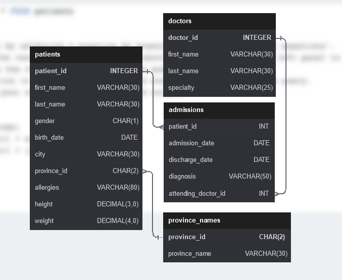

# Hospital Project

This repository contains the code and resources for a Hospital Project, which is a practice project available at [sql-practice.com](https://www.sql-practice.com/). The project is designed to help users enhance their SQL skills by working on a realistic scenario in a hospital setting.

## Project Overview

The Hospital Project aims to simulate a database management system for a hospital, where various aspects of hospital management can be practiced and explored. The project includes a set of SQL exercises that cover different scenarios and challenges commonly encountered in hospital environments.

